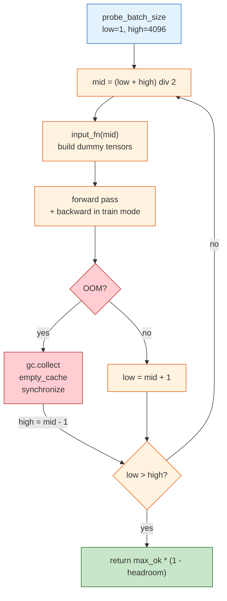

# batch-probe

[](https://github.com/ahb-sjsu/batch-probe/actions/workflows/ci.yml)
[](https://pypi.org/project/batch-probe/)
[](https://pypi.org/project/batch-probe/)
[](LICENSE)

GPU memory probing and thermal-aware CPU thread control.

Binary search with OOM recovery, configurable safety headroom, no framework required. New in v0.4.0: thermal-aware thread tuning for CPU workloads.

## The Problem

Every ML practitioner has done this:

```
batch_size = 64   # OOM
batch_size = 32   # OOM
batch_size = 16   # OOM
batch_size = 8    # works... but am I leaving GPU memory on the table?
```

`batch-probe` automates this. It binary-searches for the largest batch size your model can handle, with a safety margin so you don't OOM during real training.

## Install

```bash
pip install batch-probe
```

## Quick Start

```python
from batch_probe import probe_batch_size

batch_size = probe_batch_size(
    model,
    lambda bs: {
        "input_ids": torch.zeros(bs, 512, dtype=torch.long, device="cuda"),
        "attention_mask": torch.ones(bs, 512, dtype=torch.long, device="cuda"),
    },
)
# batch-probe: probing batch size (mode=train, range=[1, 4096], headroom=20%)... max=6, safe=4
```

That's it. Three lines. Works with any `nn.Module`.

## Usage

### Encoder models (BERT, RoBERTa, etc.)

```python
batch_size = probe_batch_size(
    model,
    lambda bs: {
        "input_ids": torch.zeros(bs, 128, dtype=torch.long, device="cuda"),
        "attention_mask": torch.ones(bs, 128, dtype=torch.long, device="cuda"),
    },
    mode="train",
)
```

### Seq2seq models (T5, BART, etc.)

```python
batch_size = probe_batch_size(
    model,
    lambda bs: {
        "input_ids": torch.zeros(bs, 512, dtype=torch.long, device="cuda"),
        "attention_mask": torch.ones(bs, 512, dtype=torch.long, device="cuda"),
        "labels": torch.zeros(bs, 512, dtype=torch.long, device="cuda"),
    },
    mode="train",
)
```

### Vision models

```python
batch_size = probe_batch_size(
    model,
    lambda bs: {"x": torch.randn(bs, 3, 224, 224, device="cuda")},
    mode="infer",
)
```

### Inference-only probing

Inference uses ~2-4x less memory than training (no gradients stored):

```python
infer_batch = probe_batch_size(model, input_fn, mode="infer")
train_batch = probe_batch_size(model, input_fn, mode="train")
# infer_batch >> train_batch
```

### Custom headroom

Default is 20% safety margin. Adjust for your risk tolerance:

```python
# Conservative (40% headroom) — for long training runs
batch_size = probe_batch_size(model, input_fn, headroom=0.4)

# Aggressive (5% headroom) — squeeze every last sample
batch_size = probe_batch_size(model, input_fn, headroom=0.05)
```

### Caching

Use `cached_probe` to avoid re-probing the same model:

```python
from batch_probe import cached_probe, clear_cache

batch_size = cached_probe(model, input_fn, mode="train")  # probes
batch_size = cached_probe(model, input_fn, mode="train")  # cache hit

clear_cache()  # reset if model changed
```

## How It Works

1. Binary search between `low` (default 1) and `high` (default 4096)
2. At each midpoint, create dummy tensors via your `input_fn`
3. Run a forward pass (+ backward pass in train mode)
4. If OOM: upper bound ← midpoint − 1, clean GPU memory
5. If success: lower bound ← midpoint + 1
6. Return `int(max_successful × (1 − headroom))`

The OOM recovery uses `gc.collect()` + `torch.cuda.empty_cache()` + `torch.cuda.synchronize()` to fully reclaim memory between iterations.



## vs. Alternatives

| Feature | batch-probe | Lightning BatchSizeFinder | HF `auto_find_batch_size` |
|---|---|---|---|
| Works with raw PyTorch | Yes | No (needs LightningModule) | No (needs HF Trainer) |
| Algorithm | Binary search | Power-of-2 scaling | Halve on OOM |
| Configurable headroom | Yes | No | No |
| Train + infer modes | Yes | Train only | Train only |
| Dependencies | torch only | pytorch-lightning | accelerate |

## API Reference

### `probe_batch_size(model, input_fn, *, mode, low, high, headroom, device, verbose)`

Find the maximum safe batch size.

- **model** (`nn.Module`): Your model, already on the target device.
- **input_fn** (`Callable[[int], dict[str, Tensor]]`): Takes batch size, returns dict of tensors for `model(**inputs)`.
- **mode** (`"train"` | `"infer"`): Train mode runs forward + backward. Default: `"train"`.
- **low** (`int`): Minimum batch size. Default: `1`.
- **high** (`int`): Upper bound for search. Default: `4096`.
- **headroom** (`float`): Safety margin. Default: `0.2` (20%).
- **device** (`str | torch.device | None`): Override device. Default: model's device.
- **verbose** (`bool`): Print progress. Default: `True`.

Returns: `int` — safe batch size.

### `cached_probe(model, input_fn, *, mode, **kwargs)`

Same as `probe_batch_size` but caches results keyed on model class, param count, input shapes, and mode.

### `clear_cache()`

Clear all cached probe results.

---

## Thermal-Aware Thread Control (v0.4.0)

For CPU-bound workloads, `batch-probe` can find the maximum thread count that keeps your CPU under a target temperature, and continuously adjust it during long-running jobs.

### `probe_threads(work_fn, *, max_temp, low, high, settle_time, work_time, cooldown_time, verbose)`

One-shot binary search for the maximum safe thread count. Runs your workload at different thread counts and reads CPU temperature to find the thermal limit.

```python
from batch_probe import probe_threads
import numpy as np

def stress(n):
    import os
    os.environ["OMP_NUM_THREADS"] = str(n)
    for _ in range(100):
        a = np.random.randn(2000, 2000)
        _ = a @ a.T

threads = probe_threads(stress, max_temp=85.0)
print(f"Safe thread count: {threads}")
```

- **work_fn** (`Callable[[int], None]`): Function that runs a CPU workload using the given number of threads.
- **max_temp** (`float`): Maximum acceptable CPU temperature in Celsius. Default: `85.0`.
- **low** (`int`): Minimum thread count. Default: `1`.
- **high** (`int | None`): Maximum thread count. Default: `os.cpu_count()`.
- **settle_time** (`float`): Seconds to wait before reading temperature. Default: `5.0`.
- **work_time** (`float`): Seconds to run the workload per probe. Default: `10.0`.
- **cooldown_time** (`float`): Seconds to wait between probes. Default: `15.0`.
- **verbose** (`bool`): Print progress. Default: `True`.

Returns: `int` -- safe thread count.

### `ThermalController(target_temp, max_threads, min_threads, poll_interval, Kp, Ki, Kd, lookahead, verbose)`

Continuous adaptive thread controller using a Kalman-filtered thermal state estimator. Runs a background thread that reads CPU temperature and adjusts the recommended thread count using PI+D control with feedforward.

```python
from batch_probe import ThermalController

ctrl = ThermalController(target_temp=82.0, max_threads=48)
ctrl.start()

# In your workload loop:
while work_remaining:
    n = ctrl.get_threads()
    run_workload(n_threads=n)

ctrl.stop()
print(ctrl.summary())
```

- **target_temp** (`float`): Desired CPU temperature setpoint. Default: `82.0`.
- **max_threads** (`int | None`): Maximum thread count. Default: `os.cpu_count()`.
- **min_threads** (`int`): Minimum thread count. Default: `1`.
- **poll_interval** (`float`): Seconds between sensor reads. Default: `2.0`.
- **Kp, Ki, Kd** (`float`): PID controller gains. Defaults: `3.0`, `0.1`, `10.0`.
- **lookahead** (`float`): Seconds to predict ahead for proactive control. Default: `5.0`.

Methods:
- `start()` -- Start background thermal monitoring.
- `stop()` -- Stop the background thread.
- `get_threads()` -- Get the current recommended thread count (thread-safe).
- `summary()` -- Return a dict of control history statistics (temp mean/max/min, threads mean/min/max, time over target).

### `ThermalJobManager(target_temp, max_concurrent, settle_time, poll_interval, cooldown_margin, verbose)`

Manages parallel subprocess jobs with thermal throttling. Launches jobs up to `max_concurrent`, but pauses new launches when CPU temperature exceeds the target.

```python
from batch_probe import ThermalJobManager

jobs = [
    ("dataset_A", ["python", "train.py", "--data", "A"]),
    ("dataset_B", ["python", "train.py", "--data", "B"]),
    ("dataset_C", ["python", "train.py", "--data", "C"]),
]

mgr = ThermalJobManager(target_temp=85.0, max_concurrent=4)
results = mgr.run(jobs, cwd="/path/to/workdir")
# results: {"dataset_A": 0, "dataset_B": 0, "dataset_C": 0}
```

- **target_temp** (`float`): Maximum CPU temperature. Default: `85.0`.
- **max_concurrent** (`int`): Maximum simultaneous jobs. Default: `4`.
- **settle_time** (`float`): Seconds to wait after launch before reading temp. Default: `10.0`.
- **poll_interval** (`float`): Seconds between job status checks. Default: `5.0`.
- **cooldown_margin** (`float`): Must be this many degrees below target to launch. Default: `3.0`.

Method:
- `run(jobs, cwd=None, log_dir=None)` -- Run all jobs. Returns `dict[str, int]` mapping job name to exit code. Each job gets a log file at `{log_dir}/{name}.log`.

## License

MIT
